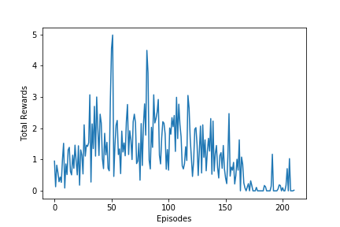

[//]: # (Image References)

[image1]: https://user-images.githubusercontent.com/10624937/43851024-320ba930-9aff-11e8-8493-ee547c6af349.gif "Trained Agent"
[image2]: https://user-images.githubusercontent.com/10624937/43851646-d899bf20-9b00-11e8-858c-29b5c2c94ccc.png "Crawler"


# Project 2: Continuous Control - DDPG

As much as I trained my DDPG agent, I was only able to get the agent to follow a similar curve to below:


**Any help on improving the training would be appreciated**.

## Critic and Policy Network
The default number of hidden nodes shown below were used in the agent. However, many other combinations were used without being more succesful to what is shown above.
```
class Policy(nn.Module):
    def __init__(self, input_dim, action_dim, h=(64,32,16)):
        super(Policy, self).__init__()
        nodes = (input_dim,)+h+(action_dim,)
        self.fc_mu = nn.ModuleList([nn.Linear(x,y) for x,y in zip(nodes[:-1], nodes[1:])])
        
    def forward(self, x):
        for layer in self.fc_mu[:-1]:
            x = F.relu(layer(x))
            
        return torch.tanh(self.fc_mu[-1](x))
    
class Critic(nn.Module):
    def __init__(self, input_dim, action_dim, h1=(64,), h2=(32,16,8)):
        super(Critic, self).__init__()
        nodes1 = (input_dim,)+h1
        self.fc1 = nn.ModuleList([nn.Linear(x,y) for x,y in zip(nodes1[:-1], nodes1[1:])])
        nodes2 = h1[:-1] + (h1[-1] + action_dim,) + h2 + (1,)
        self.fc2 = nn.ModuleList([nn.Linear(x,y) for x,y in zip(nodes2[:-1], nodes2[1:])])
        
    def forward(self, x, action):
        for layer in self.fc1:
            x = F.relu(layer(x))
        
        x = torch.cat([x, action], dim=-1)
        for layer in self.fc2[:-1]:
            x = F.relu(layer(x))
            
        return self.fc2[-1](x) 
```

## Learning Algorithm
The learning phase of the agent was carried about by the following code:
```
states, actions, rewards, next_states, dones = self.memory.sample()
target = self.qnetwork_target(next_states, self.policy_target(next_states))
target = rewards.unsqueeze(-1) + GAMMA * target
y = self.qnetwork_local(states, actions)
critic_loss = 0.5*(y - target.detach()).pow(2.0).sum(1).mean()

self.q_optimizer.zero_grad()
critic_loss.backward()
torch.nn.utils.clip_grad_norm_(self.qnetwork_local.parameters(), 1)
self.q_optimizer.step()

action = self.policy_local(states)
policy_loss = -self.qnetwork_local(states, action).mean()

self.policy_optimizer.zero_grad()
policy_loss.backward()
torch.nn.utils.clip_grad_norm_(self.policy_local.parameters(), 1)
self.policy_optimizer.step()
```
This was followed with a soft update of the target network with `TAU=1e-3`.

## Training Procedure
Every 20 time steps (not episodes) we would train the Network 10 times.